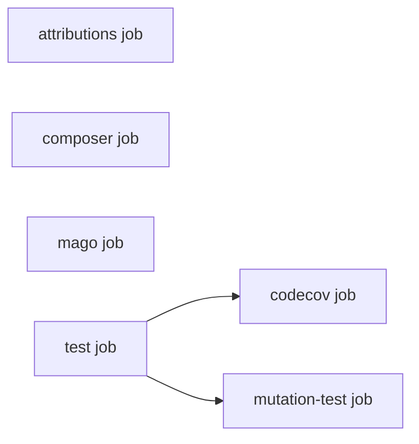

# Workflow architecture

This document describes the job-split design implemented in
[`continuous-integration.yml`](../.github/workflows/continuous-integration.yml):
an attribution check, Mago, a PHPUnit matrix with an optional seeded RDBMS for
integration testing, plus optional Composer checks, Codecov and Infection
mutation testing. It serves libraries (the defaults) and applications (see
[Applications](#applications)).

The design is inherited from
[php-db/phpdb-qa-tools](https://github.com/php-db/phpdb-qa-tools) via
[contenir/contenir-qa-tools](https://github.com/contenir/contenir-qa-tools),
which adds the `attributions` and `composer` jobs, the application inputs, the
`apt-packages` input, Codecov failing the build, and runners pinned to
`ubuntu-24.04`. Peptolab changes only the defaults: Codecov and Infection are
on, with both MSI thresholds at 90.

## Job graph

Only genuine data/gating dependencies are expressed via `needs:`; everything
else runs in parallel for speed.



- `attributions`, `composer`, `mago` and `test` have **no `needs:`** between them —
  they're independent gates, none consumes another's output.
- `codecov` and `mutation-test` both **`needs: [test]`** — real dependencies
  (artifact consumption / gating), not just ordering preference.

Every job runs on `ubuntu-24.04` rather than `ubuntu-latest`, so a runner
image upgrade can't change system packages underneath a passing build.

## `attributions` job

Peptolab policy: no AI attribution in pull request titles, descriptions or
commit messages. On `pull_request` the job checks the title, the description
and every commit between the base branch and `HEAD`; on `push` it checks the
pushed range (`before..after`), falling back to the last commit when a branch
is first created. Any match fails the build with an error annotation.

## `composer` job

Runs only when `enable-composer-validate` or `enable-composer-audit` is set:
`composer validate --strict`, then `composer audit --locked
--abandoned=report` (known advisories in the lock file fail the job; abandoned
packages are only reported). No dependency install is needed.

## `mago` job

Matrix: `php-versions` only. Runs `mago format --check`, `mago lint`,
`mago analyze`, and `mago guard` (unless `mago-guard: false`), plus
`vendor/bin/rector process --dry-run` when `enable-rector` is set. No DB, no
dependency-strategy matrix — the committed `composer.lock` is enough for type
resolution.

## `test` job

Matrix: `php-versions x dependency-versions`, by default
`php x [lowest, locked, latest]`.

### System packages

When `apt-packages` is set, the listed Ubuntu packages are installed with
`apt-get` before the tests run — for tools the tests shell out to, such as
the qpdf and Poppler CLIs `php2pdf`'s integration tests drive. The list is passed through an env
var and word-split, never interpolated into the script. Empty (the default)
skips the step.

### DB service (manual step, not native `services:`)

Native job-level `services:` blocks *can* be conditionally disabled (an
empty `image:` expression means the service won't start — see
[GitHub's docs](https://docs.github.com/en/actions/reference/workflows-and-actions/workflow-syntax#jobsjob_idservicesservice_idimage)),
so conditionality alone isn't why this uses a manual step. The real
constraint: `services.<id>.env` is a **static YAML map** — its *keys* must
be fixed at authoring time, and expressions can only substitute values, not
key names. Different engines need different env var names entirely
(MySQL's `MYSQL_ROOT_HOST`/`MYSQL_DATABASE`, Postgres's
`POSTGRES_PASSWORD`/`POSTGRES_DB`, ...), so a single generic `db-env-json`
input (arbitrary keys, unknown to the workflow until runtime) can't be
expressed through native `services:` at all — only a step that parses JSON
at runtime (the `jq` unpacking below) can.

**This is deliberately engine-agnostic** — the workflow never hardcodes
MySQL (or any other engine). A repository with no database never sets
`db-image` and pays zero cost. A repository that needs one (MySQL, Postgres,
MariaDB, Oracle, MSSQL, ...) supplies its own image/env/port/health-command;
SQLite needs no service at all (embedded, no server) and also just omits
`db-image`.

```yaml
- name: Start DB service
  if: inputs.db-image != ''
  run: |
    docker run -d --name db \
      -p ${{ inputs.db-port }}:${{ inputs.db-port }} \
      $(echo '${{ inputs.db-env-json }}' | jq -r 'to_entries[] | "-e \(.key)=\(.value)"' | tr '\n' ' ') \
      ${{ inputs.db-image }}

- name: Wait for DB to be healthy
  if: inputs.db-image != ''
  run: |
    for i in $(seq 1 ${{ inputs.db-health-retries }}); do
      docker exec db ${{ inputs.db-health-cmd }} && exit 0
      sleep ${{ inputs.db-health-interval-seconds }}
    done
    echo "DB did not become healthy in time" && exit 1
```

`jq` unpacks the `db-env-json` map into `-e KEY=VALUE` flags since `docker
run` doesn't accept JSON directly. The health check polls via `docker exec`
in a retry loop rather than Docker's native `HEALTHCHECK`, so it works the
same regardless of image. No explicit teardown is needed — GitHub-hosted
runners are ephemeral.

`db-health-retries` / `db-health-interval-seconds` default to `30` / `2`
(60s total — plenty for MySQL/Postgres/MariaDB) but are overridable per
caller, since Oracle/MSSQL images can take several minutes to become ready.

### Coverage

Unit tests always run (`test-script`); integration tests run
`if: inputs.run-integration` (`integration-test-script`). When `codecov` or
`mutation-test` is enabled, exactly one canonical leg — `coverage-php-version`
(or the first `php-versions` entry) with `locked` dependencies — runs
`test-coverage-script` under pcov instead, and uploads `clover.xml` via
`actions/upload-artifact` for the downstream jobs.

## `codecov` job

`needs: [test]`, job-level `if: inputs.enable-codecov`. Downloads the
`clover.xml` artifact and runs `codecov/codecov-action`. No PHP setup, no DB.
`fail_ci_if_error: true` — a failed upload (missing token, Codecov outage)
fails the build rather than passing silently. (php-db runs report-only.)

`CODECOV_TOKEN` is an org-wide upload token (set it as a peptolab
organisation secret before enabling Codecov), so it can't infer the target
repo on its own — pass `slug: ${{ github.repository }}`. Inside a
*reusable* workflow, `github.repository` already resolves to the **calling**
repo, so this works with no extra input.

## `mutation-test` job

`needs: [test]` (gating — skip if base tests already failed). Job-level
`if: inputs.enable-infection`. Needs its own full environment (checkout,
setup-php **with `tools: mago`**, the `apt-packages` step, `composer install
--locked`, the same conditional DB-startup step as `test` if
`run-integration`) since Infection re-executes the suite per mutant — it
can't just consume `test`'s artifact the way `codecov` does.

**No `needs: [mago]`.** `infection.json5`'s `staticAnalysisTool: "mago"`
makes Infection invoke `mago analyze` internally against mutants that escape
the test suite — that's a tooling requirement inside this job (the `mago`
binary + the repo's own `mago.toml`), not a cross-job dependency on the
`mago` job.

`INFECTION_DASHBOARD_API_KEY` is a per-repo secret (generated by registering
the repo at dashboard.stryker-mutator.io). Either
`INFECTION_DASHBOARD_API_KEY` or `STRYKER_DASHBOARD_API_KEY` works as the env
var name. **Must be passed as an `env:` block on the `run:` step, not as a
`with:` input** — Infection reads it from the environment, not a CLI flag.

`min-msi` / `min-covered-msi` (both default `"90"` in Peptolab) control the
MSI threshold that fails the job. A repository still building its baseline
lowers them in its caller and ratchets them back up. Passed as `composer mutation-test -- --min-msi=...
--min-covered-msi=... --logger-github` (the composer script itself stays
plain `infection`, flags are appended at invocation time).

## Applications

The defaults suit a library. An application deploys its lock file, boots from
configuration and may depend on private repositories, so the workflow takes:

- `dependency-versions: '["locked"]'` — only the deployed dependency set is tested.
- `php-extensions` — the `ext-*` packages composer.json requires, for every job
  that installs dependencies.
- `dotenv` — written to `.env` before dependencies install, for apps whose
  bootstrap loads it (phpdotenv's `createImmutable()` throws without it).
- `SSH_PRIVATE_KEY` secret — loaded into ssh-agent before every composer run,
  for VCS dependencies cloned over SSH. Pass it explicitly
  (`secrets: { SSH_PRIVATE_KEY: ${{ secrets.MY_DEPLOY_KEY }} }`) or name the
  repository secret `SSH_PRIVATE_KEY` and use `secrets: inherit`.
- `test-script` / `test-coverage-script` / `integration-test-script` /
  `mutation-test-script` — when the app's composer scripts use other names.
- `enable-rector`, `enable-composer-validate`, `enable-composer-audit` — checks
  an application usually runs alongside Mago.

Anything else app-specific (a macOS leg, a second database engine) stays as an
extra job in the caller's workflow next to `uses:`.

## Secrets

Because `CODECOV_TOKEN` is org-scoped and `INFECTION_DASHBOARD_API_KEY` and
`SSH_PRIVATE_KEY` are repo-scoped, each consuming repo's caller workflow should invoke this
reusable workflow with `secrets: inherit` rather than an explicit per-secret
mapping — it transparently pulls from whichever scope actually defines each
secret. Cross-repo `secrets: inherit` works for reusable workflows called
within the same GitHub org.

## Inputs

| Input | Purpose |
|---|---|
| `php-versions` | JSON array of PHP versions for the matrix (default `["8.2", "8.3", "8.4", "8.5"]`). The first entry is the coverage version when `coverage-php-version` is empty. |
| `dependency-versions` | JSON array of dependency strategies (default `["lowest", "locked", "latest"]`). Applications pass `["locked"]`. Keep `locked` when coverage or mutation testing is on. |
| `php-extensions` | Comma-separated extensions for setup-php in the `mago`, `test` and `mutation-test` jobs. |
| `run-integration` | Run the integration suite as well as the unit suite (default `false`). |
| `composer-options` | Extra flags passed to every `composer install` / `update`. |
| `dotenv` | Contents written to `.env` before dependencies install in `test` and `mutation-test`. Empty (default) writes nothing. |
| `test-script` | Composer script for the unit suite (default `test`). |
| `test-coverage-script` | Composer script for the coverage leg; must write `clover.xml` (default `test-coverage`). |
| `integration-test-script` | Composer script for the integration suite (default `test-integration`). |
| `mutation-test-script` | Composer script that runs Infection (default `mutation-test`). |
| `mago-guard` | Run `mago guard` (default `true`). |
| `enable-rector` | Run `vendor/bin/rector process --dry-run` in the `mago` job (default `false`). |
| `enable-composer-validate` | Run `composer validate --strict` in the `composer` job (default `false`). |
| `enable-composer-audit` | Run `composer audit --locked` in the `composer` job (default `false`). |
| `db-image` | Container image for the DB service (e.g. `mysql:8.0`). Empty = no DB. |
| `db-env-json` | JSON object of container env vars. |
| `db-port` | Port to expose/map. |
| `db-health-cmd` | Command run via `docker exec` to check readiness. |
| `db-health-retries` | Max health-check attempts (default `30`). Raise for slow-starting engines (Oracle, MSSQL). |
| `db-health-interval-seconds` | Seconds to sleep between health-check attempts (default `2`). |
| `enable-codecov` | Runs the `codecov` job (default `true` in Peptolab). |
| `enable-infection` | Runs the `mutation-test` job (default `true` in Peptolab). |
| `coverage-php-version` | Which matrix leg is canonical for coverage/mutation. Empty (default) = the first `php-versions` entry. |
| `min-msi` | Minimum MSI (%) required to pass `mutation-test` (default `"90"`). |
| `min-covered-msi` | Minimum covered-code MSI (%) required to pass `mutation-test` (default `"90"`). |
| `test-env-json` | JSON object of extra env vars exported (via `$GITHUB_ENV`) before running tests in `test` and `mutation-test`. |
| `apt-packages` | Space-separated Ubuntu packages `apt-get install`ed at the start of `test` and `mutation-test`, for tools the tests shell out to (e.g. `imagemagick`). Empty (default) skips the step. |

Plus `secrets: CODECOV_TOKEN`, `INFECTION_DASHBOARD_API_KEY`,
`SSH_PRIVATE_KEY` on `workflow_call` (all `required: false`).

### Overriding a `phpunit.xml.dist` connection setting for CI

PHPUnit's `<env>` element does **not** override an already-set real
environment variable unless `force="true"` is set. This means a caller can
override a `phpunit.xml.dist` default (e.g. a DB hostname that needs to
differ between local dev and CI) via `test-env-json`, without editing that
file or needing `force="true"` (which would break the local-dev default).

For example, a repository whose local `compose.yml` runs PHP and MySQL on the
same Docker Compose network would default its hostname variable to `mysql`
(the container name). In CI the `test`/`mutation-test` jobs run directly on
the runner VM (no `container:` key), so the DB started by the `docker run`
step is only reachable via `127.0.0.1` and the mapped port. Setting
`test-env-json: '{"TESTS_DB_HOSTNAME":"127.0.0.1"}'` in the caller workflow
resolves this without touching `phpunit.xml.dist`.

## Reference example

`contenir/contenir-storage`'s caller workflow
(`.github/workflows/continuous-integration.yml`) is the reference example:
integration tests, Codecov, Infection at 100% MSI, and `apt-packages` for
ImageMagick. For a DB-backed example, `php-db/phpdb-mysql` wires up every
`db-*` input.
